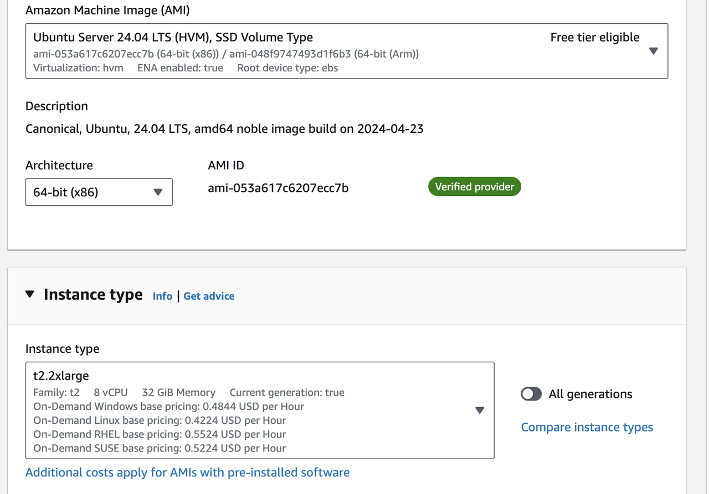
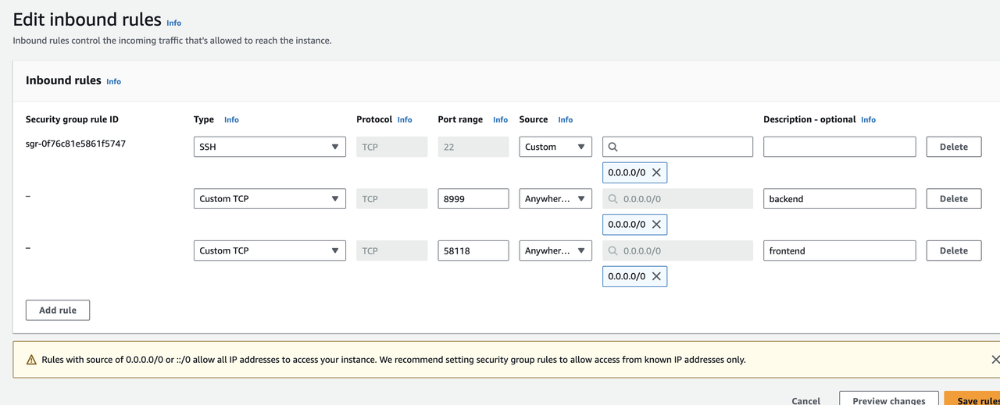
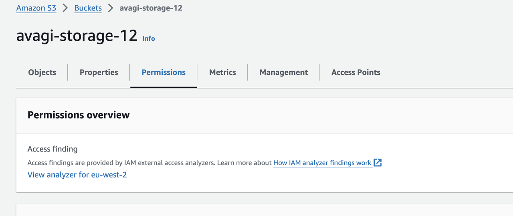
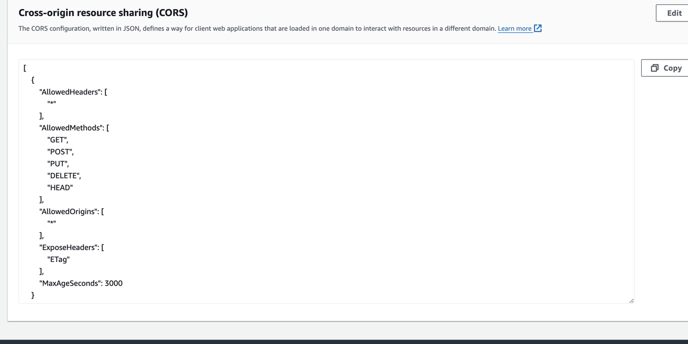

# avagi_3d_vis
The web visualization of created avagi3d charactors. This work was done by my colleague Zhouhan Zhang, and I am the organizer only.

# Pre-requirements

You will need to set up the EC2 instance and S3 on the AWS for this development.

## EC2



* within the EC2 instance, download the mini-conda.

```
wget https://repo.anaconda.com/miniconda/Miniconda3-latest-Linux-x86_64.sh
bash Miniconda3-latest-Linux-x86_64.sh
source ~/.bashrc
conda --version
```
After running conda --version, if it shows conda 24.4.0, then it succeeds. 

* download the npm
```
sudo apt update
sudo apt install nodejs npm
node -v
npm -v
```
After running 'node -v' and 'npm -v', if it shows 'v18.19.1' and '9.2.0' respectively, then it succedds.

* download the GitHub code into the EC2 instance
```
https://github.com/protagolabs/avagi_3d_vis.git
cd avagi_3d_vis
```

* install the dependences
```
conda create --name 3dAvagi python=3.11
conda activate 3dAvagi
cd back-end/src
pip install -r requirements.txt
```

* Edit the port
In the AWS EC2 instance console, edit the inbound security group, add the front-end port (58118) and back-end (8999), the port may change due to the availability. Please check.


## S3 CORS

* In AWS console, open the S3 Buckets, goto the bucket you want to use, and get into "Permissions" tab.



* In the Permission tab, scroll down to CORS section, click 'Edit', to paste in following text, and save the change.
```
[
    {
        "AllowedHeaders": [
            "*"
        ],
        "AllowedMethods": [
            "GET",
            "POST",
            "PUT",
            "DELETE",
            "HEAD"
        ],
        "AllowedOrigins": [
            "*"
        ],
        "ExposeHeaders": [
            "ETag"
        ],
        "MaxAgeSeconds": 3000
    }
]

```



* In the code of S3Utils, replace the 'aws_access_key_id', 'aws_secret_access_key', 'region_name', 'Params={'Bucket': 'avagi-storage-12'' with correct values.
```
        # connect to the hragent bucket in S3
        session = boto3.Session(
            aws_access_key_id='your_access_key',
            aws_secret_access_key= 'your_secret_key',
            region_name='eu-west-2'  # change to the location of your s3 bucket
        )
        self.s3_client = session.client('s3')
        self.s3_resource = session.resource('s3')
        self.bucket = self.s3_resource.Bucket('your s3 bucket name here')
```

```
async def generate_download_link(self, file_key, expires=3600):
   return self.s3_client.generate_presigned_url('get_object',
                       Params={'Bucket': 'your s3 bucket name here',
                       'Key': file_key},
                        ExpiresIn=expires)
```

## Other settings
* make sure add the public ipv4 with port 8999  in line 19 in fastAPI.py as follow.

```
app.add_middleware(
    CORSMiddleware,
    allow_origins=["http://localhost:3000", "your public ipv4 address:8999"],  # Allows access from your React app
    allow_credentials=True,
    allow_methods=["*"],  # Allows all methods
    allow_headers=["*"],  # Allows all headers
)
```

* make sure the port in line 104 is "0.0.0.0" as the one in step "Edit the port"


# Back-end
```
screen -S 3DAvagiBackend
python fastAPI.py
```

# Front-end
```
screen -S 3DAvagiFront
cd front-end
npm install --production
npm install bootstrap
HOST=0.0.0.0 PORT=58118 npm start --production
```


